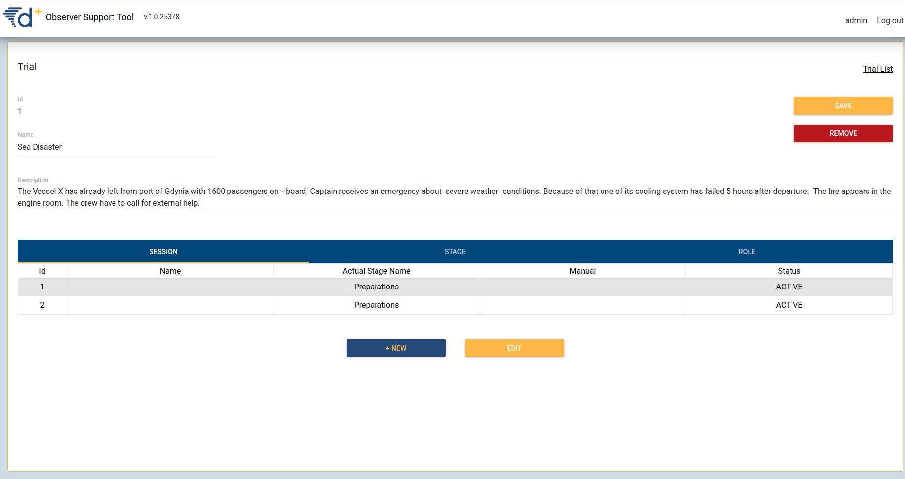
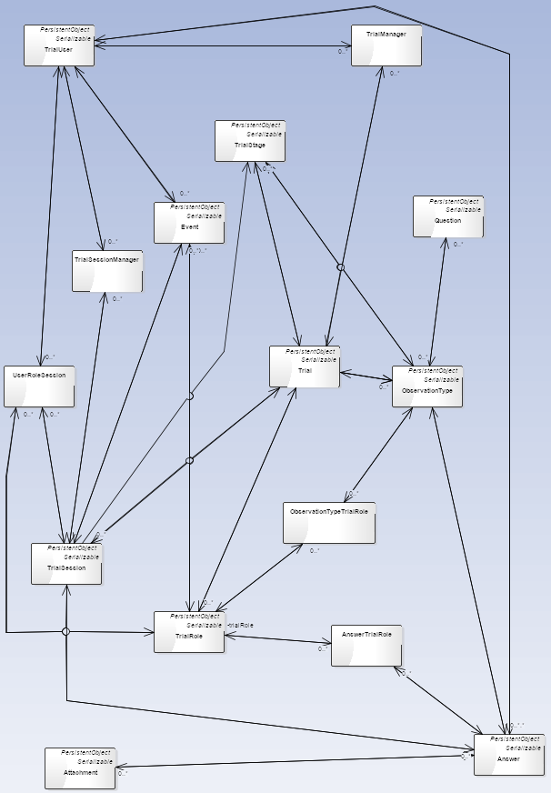

# OST documentation

## 1. Component diagram

Backend, frontend and database can be launched by one docker compose.  Backend can connect with Testbed (Kafka) and with Keycloak (system to authorization). 


### 2. User Manual

              User can login to server as admin or observer. Admin can manage trials, session, stages, roles, add question to roles and stages, add and edit users and control active session.  Observer can answer on question and comment it.

#### Admin

Goal of admin is creating working session for observers. This process contains three stages: creating trial with questions, creating roles and assign them to question set and preparing session with users. To create questions admin should create trial, stages in trial, question sets in stages and question in question sets. Description can be find in subsection named ,,Creating trial with questions&quot;. Second part is creating roles and assign them to question set (which already are assign to stage). It means, that question, which are available for observer, depends on stage and on role of logged observer. Last step is creating session with observers. Observers in other sessions can have other roles, so assignment user to role in session. Admin needn&#39;t create new users, if observers have their account in system. Description of this step can be find in subsection ,,Managing users and sessions&quot;.

Creating trial with questions

#### Trial list

If we choose &quot;TRIALS&quot; from launch window we will be redirected to Trial List.

There is a list of trials, which can be managed also we can upload after choosing &quot;Import trial&quot; button.


#### Trial details

After choosing trial from trial list and click edit or after double clicking left mouse button on trial from trial list, system redirects to trial details. There are basic details about trial and data about sessions, stages and roles in trial.

Also trial can be edited and removed there.



#### Stage details

After choosing stage from trial details and click edit or after double clicking left mouse button on stage from trial details, system redirects to stage details. There are basic details about stage, which can be edited. Also stage can be deleted by admin. Question set list of chosen stage is below basic stage details. You can redirect to trial by clicking trial name above save button.


### Question set details

In question set details windows admin can change name or description also list of questions of this question set is shown. User can redirect to the chosen question by double clicking on question or clicking question and edit. You can redirect to trial or stage by clicking trial name or stage name above save button.


#### Question details

In question details admin can modify question, description or type of answer. Also admin can add new options of choice, show them or remove. In question details parameters like commented and required can be set. You can redirect to trial, stage or question set by clicking trial name, stage name or question set name  above save button.

#### Question option can be add after saving question.


#### Creating roles and assign it to question set

##### Role details

After choosing role from trial details and click edit or after double clicking left mouse button on role from trial details, system redirects to role details. There are basic details about role, which can be edited. Also in  role details we can manage of user assignment to role and question set, which should be show, when right stage is chosen. You can redirect to trial by clicking trial name above save button.


#### Managing users and sessions

##### Session details

New session can be created by clicking +New, when session window in trial detail is active.

After choose session from trial details and click edit or after double clicking left mouse button on session from trial details, system redirects to session details. There are basic details about session, which can be edited or deleted, also data from session can be downloaded. In the user role table admin can assign role to user in this session. User can answer on question only if session is active.


#### Session tracking details

After clicking session from launch window, system redirects to session tracking detail. In session tracking details admin can control active sessions. There are informations, which trial is currently used, if session is controlled by testbed  or manually (manual column) and which stage is active at this moment.


#### User list

If we choosing &quot;USERS&quot; in launch window we will be redirected to User list. There are some basic data about user there.


#### User details

After choosing user from user list and click edit or after double clicking left mouse button on user from user list, system redirects to user details. There are basic details about user and data about sessions, stages and roles in trial.

Also user can be edited and removed there.

If we want to add new user, we should click +New on User list. Then system redirects to user detail and after filling data, system create new user. All fields are required.


#### Observer

Observer can login to server, when admin send him his login and password. After it he can login to system.

##### Question Set view

Observer after login to system can choosing from question set from active sessions (if question sets, during present stage in active session, are available to logged user).


##### Question view

Observer after choosing question set is redirected to questions from chosen question set. Observer can answer to question from this question set by writing text (textfield) or choosing option (checkbox, radiobutton, slider).


###  3.  Deployment Manual

1. Download docker from [https://www.docker.com/](https://www.docker.com/).
2. Create file and name it _docker-compose.yml_
3. Open this file and paste to this file text below:

```yml
version: &#39;3&#39;
services:
 zookeeper:
   image: confluentinc/cp-zookeeper:latest
   hostname: zookeeper
   ports:
     - &quot;3500:3500&quot;
   environment:
     ZOOKEEPER\_CLIENT\_PORT: 3500
     ZOOKEEPER\_TICK\_TIME: 2000

 broker:
   image: confluentinc/cp-kafka:latest
   hostname: broker
   depends\_on:
     - zookeeper
   ports:
     - &quot;3501:3501&quot;
   environment:
     KAFKA\_BROKER\_ID: 1
     KAFKA\_ZOOKEEPER\_CONNECT: &#39;zookeeper:3500&#39;
     KAFKA\_ADVERTISED\_LISTENERS: &#39;EXTERNAL://localhost:3501,PLAINTEXT://broker:9092&#39;
     KAFKA\_LISTENER\_SECURITY\_PROTOCOL\_MAP: &#39;EXTERNAL:PLAINTEXT,PLAINTEXT:PLAINTEXT&#39;
     KAFKA\_LISTENERS: &#39;EXTERNAL://0.0.0.0:3501,PLAINTEXT://0.0.0.0:9092&#39;
     KAFKA\_OFFSETS\_TOPIC\_REPLICATION\_FACTOR: 1
     KAFKA\_DEFAULT\_REPLICATION\_FACTOR: 1
     KAFKA\_MESSAGE\_MAX\_BYTES: 100000000
     KAFKA\_REPLICA\_FETCH\_MAX\_BYTES: 100000000

 schema\_registry:
   image: confluentinc/cp-schema-registry:latest
   hostname: schema\_registry
   depends\_on:
     - zookeeper
     - broker
   ports:
     - &quot;3502:3502&quot;
   environment:
     SCHEMA\_REGISTRY\_HOST\_NAME: schema\_registry
     SCHEMA\_REGISTRY\_LISTENERS: &#39;http://0.0.0.0:3502&#39;
     SCHEMA\_REGISTRY\_KAFKASTORE\_CONNECTION\_URL: &#39;zookeeper:3500&#39;
     SCHEMA\_REGISTRY\_KAFKASTORE\_BOOTSTRAP\_SERVERS: &#39;PLAINTEXT://broker:9092&#39;

 kafka\_rest:
   image: confluentinc/cp-kafka-rest:latest
   hostname: kafka\_rest
   depends\_on:
     - zookeeper
     - schema\_registry
     - broker
   ports:
     - &quot;8082:8082&quot;
   environment:
     KAFKA\_REST\_HOST\_NAME: kafka\_rest
     KAFKA\_REST\_BOOTSTRAP\_SERVERS: &#39;PLAINTEXT://broker:9092&#39;
     KAFKA\_REST\_ZOOKEEPER\_CONNECT: &#39;zookeeper:3500&#39;
     KAFKA\_REST\_LISTENERS: &#39;http://0.0.0.0:8082&#39;
     KAFKA\_REST\_SCHEMA\_REGISTRY\_URL: &#39;http://schema\_registry:3502&#39;
     KAFKA\_CONSUMER\_REQUEST\_TIMEOUT\_MS: 30000
     KAFKA\_REST\_ACCESS\_CONTROL\_ALLOW\_METHODS: &#39;GET,POST,PUT,DELETE,OPTIONS&#39;
     KAFKA\_REST\_ACCESS\_CONTROL\_ALLOW\_ORIGIN: &#39;\*&#39;

 kafka\_topics\_ui:
   image: landoop/kafka-topics-ui:latest
   hostname: kafka\_topics\_ui
   depends\_on:
     - kafka\_rest
   ports:
     - &quot;3600:8000&quot;
   environment:
     KAFKA\_REST\_PROXY\_URL: &#39;http://kafka\_rest:8082&#39;
     PROXY: &#39;true&#39;

 kafka\_schema\_registry\_ui:
   image: landoop/schema-registry-ui:latest
   hostname: kafka\_schema\_registry\_ui
   depends\_on:
     - schema\_registry
   ports:
     - &quot;3601:8000&quot;
   environment:
     SCHEMAREGISTRY\_URL: &#39;http://schema\_registry:3502&#39;
     PROXY: &#39;true&#39;

 postgres:
   image: postgres:9.6
   hostname: postgres
   environment:
     POSTGRES\_USER: postgres
     POSTGRES\_PASSWORD: postgres
     POSTGRES\_DB: TRIAL\_ADMIN
   volumes:
      - postgres-data:/var/lib/postgresql/data
_#    restart: unless-stopped_

admintool:
   image: drivereu/test-bed-admin:latest
   depends\_on:
     - postgres
     - broker
     - schema\_registry
   ports:
     - &quot;8090:8090&quot;
   volumes:
     - ./admintool-config/gateways.json:/opt/application/config/gateways.json
     - ./admintool-config/solutions.json:/opt/application/config/solutions.json
     - ./admintool-config/topics.json:/opt/application/config/topics.json
     - ./admintool-config/standards.json:/opt/application/config/standards.json
     - ./admintool-config/testbed-solutions.json:/opt/application/config/testbed-solutions.json
     - ./admintool-config/testbed-topics.json:/opt/application/config/testbed-topics.json
     - ./admintool-config/configurations.json:/opt/application/config/configurations.json

   environment:
     KAFKA\_BROKER\_URL: broker:9092
     SCHEMA\_REGISTRY\_URL: http://schema\_registry:3502
     zookeeper\_host: zookeeper
     zookeeper\_port: 3500
     schema\_registry\_url: http://schema\_registry:3502
     testbed\_secure\_mode: &#39;DEVELOP&#39;
     testbed\_init\_auto: &#39;false&#39;
     management\_ca\_cert\_path: http://localhost:9090
     cert\_handler\_url: https://localhost:8443
     cert\_pem\_handler\_url: https://localhost:8443
     security\_rest\_path\_group: https://localhost:9443
     security\_rest\_path\_topic: https://localhost:9443

 afteractionreview:
   image: drivereu/after-action-review:latest
   depends\_on:
     - postgres
     - broker
     - schema\_registry
   ports:
     - &quot;8095:8095&quot;
   environment:
     KAFKA\_BROKER\_URL: broker:9092
     SCHEMA\_REGISTRY\_URL: http://schema\_registry:3502
     zookeeper\_host: zookeeper
     zookeeper\_port: 3500
     schema\_registry\_url: http://schema\_registry:3502

 pgadmin:
   image: fenglc/pgadmin4
   depends\_on:
     - postgres
   ports:
       - &quot;5050:5050&quot;
_#    restart: unless-stopped_

 time\_service:
   image: drivereu/test-bed-time-service:latest
   depends\_on:
     - broker
     - schema\_registry
   ports:
     - &quot;8100:8100&quot;
   environment:
     KAFKA\_BROKER\_URL: broker:9092
     SCHEMA\_REGISTRY\_URL: http://schema\_registry:3502
     AUTO\_REGISTER\_SCHEMAS: &#39;true&#39;

 large\_file\_service:
   image: drivereu/large-file-service:latest
   ports:
     - &quot;9090:9090&quot;
   environment:
     HOST: localhost
     PORT: 9090
 _# wms\_service:_
_ #   image: drivereu/test-bed-wms-service:1.0.10_
_ #   hostname: wmsservice_
_ #   environment:_
_ #     URL: http://localhost/wms/_
_ #     WMS\_PORT: 5101_
_ #     WMS\_HOST: wmsservice_
_ #     WMS\_FOLDER: /server/data_
_ #     WMS\_EXTERNAL\_PORT: 5101_
_ #     WMS\_EXTERNAL\_HOST: http://localhost/wms/_
_ #     WMS\_EXTERNAL\_ADDRESS: http://localhost/wms/_
_ #     WMS\_KAFKA\_HOST: broker:9092_
_ #     WMS\_SCHEMA\_REGISTRY: http://schema\_registry:3501_
_ #     WMS\_CORS\_ORIGIN: https://oefen-veiligheidsregio.lcms.nl_
_ #     WMS\_CORS\_HEADERS: &#39;authorization, content-type&#39;_
_ #   ports:_
_ #     - 8101:5101_
_ #   depends\_on:_
_ #     - broker_
_ #     - schema\_registry_

  trial\_management\_tool:
   image: drivereu/trial-management-tool:latest
   depends\_on:
     - broker
     - schema\_registry
   ports:
     - &#39;3210:3210&#39;
   environment:
     CLIENT\_ID: TB-TrialMgmt
     KAFKA\_HOST: broker:9092
     SCHEMA\_REGISTRY: http://schema\_registry:3502
     TRIAL\_MANAGER\_SERVER\_PORT: 3210
     PRODUCE: system\_request\_change\_of\_trial\_stage,system\_tm\_phase\_message,system\_tm\_role\_player,system\_tm\_session\_mgmt
     SSL: &#39;false&#39;
     SSL\_PFX: certs/TB-TrialMgmt.p12
     SSL\_PASSPHRASE: changeit
     SSL\_CA: certs/test-ca.pem
   volumes:
     - trial-data:/app/trials

  ost\_db:
    image: janbalbierzitti/ost\_database:fddr2\_2
    ports:
    - &quot;5437:5432&quot;
    volumes:
    - database-OST:/var/lib/postgresql/data
_#    restart: always_
  ost\_web:
    image: janbalbierzitti/ost\_frontend:fddr2\_2
    links:
    - ost\_api
    ports:
    - &quot;127.0.0.1:85:80&quot;
    - &quot;127.0.0.1:445:443&quot;
_#        restart: always_
  ost\_api:
    image: janbalbierzitti/ost\_backend:fddr2\_2
    links:
    - ost\_db
    ports:
    - &quot;8080:8080&quot;
_#    restart: always_

  silent-producer:
    image: silent-producer
    depends\_on:
     - broker
     - schema\_registry
    environment:
      KAFKA\_HOST: broker:9092
      SCHEMA\_REGISTRY: http://schema\_registry:3502
      PRODUCE\_TOPICS: simulation\_request\_unittransport,simulation\_request\_startinject,simulation\_entity\_item,sumo\_AffectedArea,standard\_cap,system\_timing,system\_topic\_access\_invite

volumes:
 database-OST:
 postgres-data:
 trial-data:
```

1. Go back to the required folder.
2. If you are windows user
  1. 1.Press **Shift + right click** mouse button anywhere on the folder window (this folder must have file docker-compose.yml).
  2. 2.Choose open powershell
  3. 3.Write in terminal **docker-compose up** and press enter
3. If you are linux/ubuntu user
  1. 1.Press **right click** mouse button anywhere on the folder window (this folder must have file docker-compose.yml).
  2. 2.Choose open terminal
  3. 3.Write there **docker-compose up** and press enter
4. Congratulation, your application has been just turned on.

### 4. API

1.  Get  /api/answers

Api let us see answer of trial session including some text inside.

@RequestParam(&quot;trialsession\_id&quot;) long trialSessionId,

@RequestParam(&quot;search&quot;) String text

**Produces Json**

**           ** TrialUserDTO.ListItem user

            String Name

String observationTypeName

String observationTypeDescription


1. Get  /api/answers/csv-file

           Api let us load CSV file with answers of session.

           @RequestParam(value = &quot;trialsession\_id&quot;) long trialSessionId

  **Return null**

1. Delete /api/answers/{answer\_id:\\d+}/remove

Api let us delete answer.

@PathVariable(value = &quot;answer\_id&quot;) long answerId,

               @RequestParam(&quot;comment&quot;) String comment

**Return null**

1. GET /api/answers-events

Api let us see all answers and events in session of current user.

@RequestParam(value = &quot;trialsession\_id&quot;) long trialSessionId

**Produces JSON**

long id;

long observationTypeId;

String name;

String description;

ZonedDateTime time;

ZonedDateTime trialTime;

String type;

1. Get  /api/event/search

Api returns list of events in session.

@RequestParam(value = &quot;trialsession\_id&quot;) long trialSessionId

**Produces JSON**

public String firstName;

public String lastName;

public String trialRoleName;


1. GET /api/observationtypes

Api returns list of question

sets

@RequestParam(&quot;trialsession\_id&quot;) Long trialSessionId

Long answersId

String name

String description

1. GET /api/observationtypes/form

Api returns roles, which can answer on question set.

@RequestParam(&quot;observationtype\_id&quot;) Long observationTypeId,

            @RequestParam(&quot;trialsession\_id&quot;) Long trialSessionId

**Return json**

List\&lt;TrialRoleDTO.ListItem\&gt; roles

 JsonNode jsonSchema,

             where in roles are two variables:

              long id,

             String name

1. /api/observationtypes/admin/addNewQuestionSet

@RequestBody

 String name

 String description

 long trailStageId;

 long trailId;

 boolean multiplicity;

 boolean withUsers;

 int position;

 List\&lt;AdminQuestionDTO.ListItem\&gt; questions = new ArrayList\&lt;\&gt;();

** Return response with http status and json**

 long id

 String name

 String description

 long trailStageId;

 long trailId;

 boolean multiplicity;

 boolean withUsers;

 int position;

 List\&lt;AdminQuestionDTO.ListItem\&gt; questions = new ArrayList\&lt;\&gt;();

1. GET /api/observationtypes/admin/getNewQuestionSet

Api let us get question set from chosen stage.

@RequestParam(value = &quot;id&quot;) long id

** Return response with http status and json**

 long id

 String name

 String description

 long trailStageId;

 long trailId;

 boolean multiplicity;

 boolean withUsers;

 int position;

 List\&lt;AdminQuestionDTO.ListItem\&gt; questions = new ArrayList\&lt;\&gt;();


1. PUT /api/observationtypes/admin/updateQuestionSet

Api let admin update question set.

@RequestBody

 String name

 String description

 long trailStageId;

 long trailId;

 boolean multiplicity;

 boolean withUsers;

 int position;

 List\&lt;AdminQuestionDTO.ListItem\&gt; questions = new ArrayList\&lt;\&gt;();

** Return response with http status and json**

 long id

 String name

 String description

 long trailStageId;

 long trailId;

 boolean multiplicity;

 boolean withUsers;

 int position;

 List\&lt;AdminQuestionDTO.ListItem\&gt; questions = new ArrayList\&lt;\&gt;();


1. DELETE /api/observationtypes/admin/deleteQuestionSet

        Api let admin delete question set from a stage.

 @RequestParam(value = &quot;id&quot;) long id

  **Return response with http status and string**

**       **

1. GET /api/questions-answers

Api returns data about answer and question.

@RequestParam(value = &quot;answer\_id&quot;) long answerId

@Produces JSON

         long answerId

        String name (of observatory type)

        String description (of observatory type)

        String time

        String trialTime

        JsonNode questionSchema

        JsonNode formData

         JsonNode trialRoles

1. POST /api/questions-answers/{answer\_id:\d+}/comment

Api let observer add comment to answer.

@PathVariable(value = &quot;answer\_id&quot;) long answerId,

@RequestParam(&quot;comment&quot;) String comment

**Return null**

1. Get /api/trial-time

Api let us know server time.

**Return String with date**

1. Get /api/time-elapsed

        Api let us know local time.

**Return String with date**

1. GET /api/role

Api shows all roles in chosen trial.

            ** Return list of roles with:**

            long id

           String name

           String roleType

1. GET api/stages

Api shows all stages

          **  Return list of stages with:**

**       ** long trialId

           String name

           LocalDateTime simulationTime

1. POST api/stages/admin/addNewTrialStage

Api let us add stage to chosen trial.

@RequestBody(

long id

long trialId

String name)

**Return response with http request status and in body are:**

Long trialId

Long id

String name

1. GET api/stages/admin/trialStageWithQuestions

Api returns stage with id

@RequestParam(value = &quot;id&quot;) long id

**Return response with http request status and in body are:**

Long trialId

Long id

String name

LocalDateTime simulationTime;

List\&lt;AdminObservationTypeDTO.ListItem\&gt; questions = new ArrayList\&lt;\&gt;()

1. DELETE api/stages/admin/deleteTrialStage

Api delete a trial&#39;s stage.

@RequestParam(value = &quot;id&quot;) long id

**Return response with a http request status and a String**

**&quot;Trial Stage id =&quot; + id + &quot; is deleted&quot;.**

1. PUT api/stages/admin/updateTrialStage

Api update a trial&#39;s stage.

  long id

  long trialId

  String name

**Return**

** long id**

** long trialId**

** String name**


1. GET /api/role

Api shows all roles in chosen trial.

            ** Return list of roles with:**

            long id

            String name

            String roleType


1. GET /api/trialsessions/{trialsession\_id:\d+}

Api shows data about chosen trial session.

@PathVariable(value = &quot;trialsession\_id&quot;) long answerId

**Return json with:**

long trialId

String trialName

String trialDescription

String lastTrialStage

1. GET /api/trialsessions

           Api shows list of trial session.

Api shows all trials, which are available for logged user.

**Return list of trials with:**

long trialId

String trialName

String trialDescription

String lastTrialStage

1. GET /api/trialsessions/active

Api shows list of active trial session avaiable from logged user.

**Return list of trials:**

long trialId

String trialName

String trialDescription

String lastTrialStage

long initId

Boolean initHasAnswer

String name

1. PUT /api/trialsessions/{trialsession\_id:\d+}/changeStatus

Api let us change status of trial session.

@PathVariable(value = &quot;trialsession\_id&quot;) long trialSessionId,

@RequestParam(value = &quot;status&quot;) String status

**Return null**

1. GET /api/trialsessions/manual/{trialsession\_id}/{is\_manual}

Api let us choose if stages of trial will be change manually or automatically.

@PathVariable long trialsession\_id,

@PathVariable boolean is\_manual

**Return String**

&quot;current stage in session &quot; +trialSession.getId() + &quot; is: &quot; +trialSession.getLastTrialStage().getId() + &quot;/&quot;+trialSession.getLastTrialStage().getName()

                + &quot;  manual mode is &quot; +isManual

1. PUT /api/trialsessions

Api let change stage of trial session

@PathVariable(value = &quot;id&quot;) Long trialSessionId,

@RequestBody @Validated TrialStageDTO.MinimalItem minimalItem,

Where minimalItem is json {id:value}

**Return json**

long trialId;

            Long lastTrialStageId;

LocalDateTime startTime;

LocalDateTime pausedTime;


1. POST /api/trialsessionscreateNewSessionFile

Api let administrator create new session users and create file with their usernames and passwords.

@RequestBody NewSessionForm newSessionForm,

Where newSessionForm is a json

{long trialId

String initialStage

String prefix

String status

 List\&lt;UserForm\&gt; users}, where

UserForm is a json

{String email

List\&lt;String\&gt; role}

**Return null**

1. GET /api/trialsessions/trials

Api shows all trails, which current user is a session manager.

**Return Map(Id : Long, name : String)**


1. POST /api/trialsessionsnewSessionValues

Api returns data about trial.

@RequestParam(value = &quot;trial\_id&quot;) long trialId

**Return trial node** , in trial node we can find

trialStages, trialRoles, authUsers

1. POST  /api/trialsession/admin/addNewUserRoleSession

Api let us add user to role in trial&#39;s session.

@RequestBody

 long trialUserId

 long trialRoleId

 long trialSessionId

**Return adminUserRoleDTO**

1.  DELETE /admin/deleteUserRoleSession

Api let us delete user from trial&#39;s session.

@RequestParam(value = &quot;trialRoleId&quot;) long trialRoleId,

@RequestParam(value = &quot;trialUserId&quot;) long trialUserId,

            @RequestParam(value = &quot;trialSessionId&quot;) long trialSessionId

**            Return Response with http status and string &quot;Trial user session is deleted&quot;**


1. GET /api/ostAllQuestionsForMobile

Api returns data about questions set.

**Return List\&lt;ObservationTypeDTO.SchemaItem\&gt;**

List\&lt;Long\&gt; answersId

String name

String description

long id

List\&lt;TrialRoleDTO.ListItem\&gt; roles

JsonNode jsonSchema, where jsonSchema is schema of all questions in question set.

1. GET api/ostTrialId

Api returns id of Trial.

**Return Long**

1. GET api/ostTrialSessionId

Api returns id of Trial Session.

**Return Long**

1. GET api/ostTrialStageId

Api returns id of Trial Stage.

**Return Long**

1. POST api/admin/addNewTrial

Api let user create trial with name and default parameters

       private long trialIdString

        trialName

        String trialDescription

        String lastTrialStage

        private Boolean archived

**Return json**

**   **

**       **  long trialIdString

        trialName

        String trialDescription

        String lastTrialStage

        Boolean archived


1. POST api/admin/updateTrial

        Api let edit trial.

 Request Body AdminTrialDTO.ListItem

 long trialId;String trialName

            String trialDescription

            String lastTrialStage

            Boolean archived

**            Return json**

**       ** long trialId

            String trialName

            String trialDescription

            String lastTrialStage

            Boolean archived


1. GET api/ostTrail

Api returns active Sessions and their actual stages.

RequestParam(value = &quot;trial\_name&quot;) String trialName

Return String of actual sessions and stages.

1. GET api/stages

Api returns stages of chosen session.

@RequestParam(value = &quot;trial\_id&quot;) long trialId, Pageable pageable)

**Return**  **PageDTO\&lt;**** TrialStageDTO.ListItem\&gt;.**

In the json are:

long trialId

String name

LocalDateTime simulationTime,

  long id.

1. GET api/user

           Api shows users in chosen trial session.

           RequestParam(value = &quot;trialsession\_id&quot;) long trialSessionId, Pageable pageable

  **          Return PageDTO\&lt;TrialUserDTO.ListItem\&gt;**

**           ** In the json are:

            long id

            String firstName

            String lastName

1.  GET api/user/version

            Api shows actual version of application.

**            Return String**

1. POST api/questions/admin/addNewQuestion

Api let add question to question set.

@RequestBody

String name

String description

long observationTypeId

AnswerType answerType

int position

String jsonSchema

boolean commented

**Return response with http status and json**

**       ** long id;

         String name;

        String description;

             long observationTypeId;

 AnswerType answerType

             int position

             String jsonSchema

             boolean commented


1. GET api/questions/admin/getFullQuestion

Api let us get details about question.

@RequestParam(value = &quot;id&quot;) long id

**Return response with http status and json**

**       ** long id;

         String name;

        String description;

             long observationTypeId;

 AnswerType answerType

             int position

             String jsonSchema

             boolean commented


1. DELETE api/questions/admin/deleteQuestion

Api let us delete question from question set.

(@RequestParam(value = &quot;id&quot;) long id)

**Return response with http status and string**

&quot;Question id =&quot; + id + &quot; is deleted&quot;

1. PUT api/questions/admin/updateQuestion

Api let us update question.

@RequestBody

String name

String description

long observationTypeId

AnswerType answerType

int position

String jsonSchema

boolean commented

**Return response with http status and json**

**       ** long id;

         String name;

        String description;

             long observationTypeId;

 AnswerType answerType

             int position

             String jsonSchema

             boolean commented


### 5. Database

This database is used in OST system.



In this model ObservationType=Question Set.
