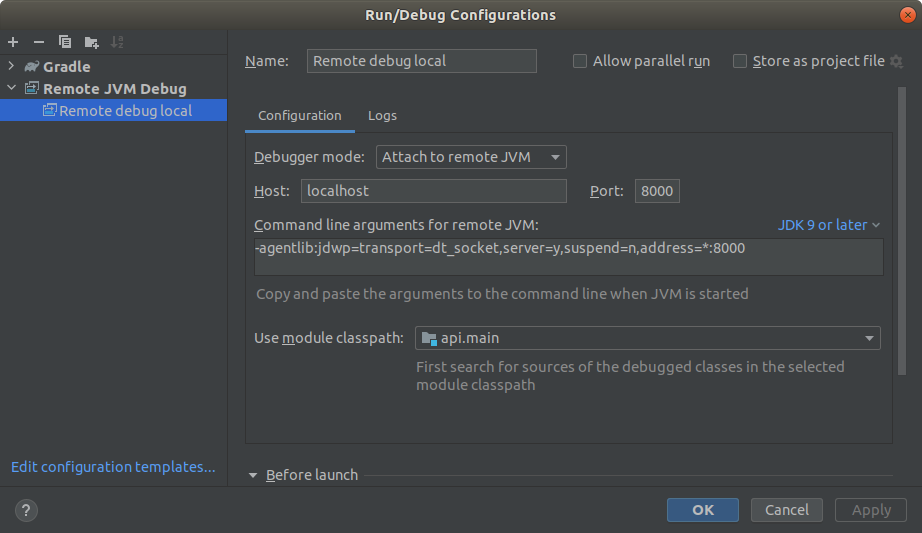

## Jak zbudować i uruchomić ost ze zdalnym debugowaniem lokanie. 
Aby zbudować i uruchomić ost lokalnie wystarczy użyć docker-compose.yml zawarty w głównym folderze projektu.
Kiedy otworzy się folder projektu w terminalu i użyje komendy:
```shell
sudo docker-compose up -d
```
powinno automatycznie zbudować i uruchomić frontend i backend.
Aby wyłączyć ten setup wystarczy w tym samym folderze w terminalu użyć komendy:
```shell
sudo docker-compose down
```
Wykonanie tej komendy pobierze odpowiednie obrazy dockerowe i zbuduje na ich podstawie nowe zawierające działający projekt.
W folderze _config znajdują się pliki konfiguracyjne do tomcat'a i nginx'a oraz certyfikaty ssl. W razie gdyby certyfikaty wygasły 
wystarczy je usunąć i wygenerować nowe komendą:
```shell
penssl req -newkey rsa:2048 -nodes -keyout key.pem -x509 -days 365 -out certificate.pem -subj "/C=PL/ST=itti/L=itti/O=itti/OU=itti/CN=itti"
```
Aby wyłączyć w backendzie debugging wystarczy w docker-compose.yml zakomentować linijkę 
```
      - ./_config/catalina.sh:/usr/local/tomcat/bin/catalina.sh
```
znakiem # i uruchomić ponownie docker-compose

## Czyszczenie po wielu budowaniach projektu
Niestety wraz z budowaniem tej konfiguracji powstają niepotrzebne obrazy dockerowe, które zajmują miejsce na dysku 
i wymagają ręcznego usunięcia. Na szczęście można to zrobić jedną komendą:
```shell
sudo docker image prune
```
, która usuwa nieużywane obrazy dockerowe.

## Podłączenie się do zdalnego debugowania backendu
Aby zdalnie debugować backend w ineliju należy w nim otworzyć folder api jako projekt i stworzyć nową konfigurację 
uruchamiania taką jak poniżej 

## Odczytywanie konsoli z kontenera z backendem i forntendem
Aby sprawdzić logi z konsoli z uruchominego backednu wystarczy użyć komendy:
```shell
sudo docker logs ost_api
```
, a frontendu:
```shell
sudo docker logs ost_web
```