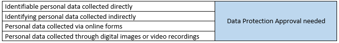

# Constraints

## Observer Support Tool - Mobile
- Web browser
- Android (tablet and smartphone)
- iOS (tablet and smartphone)

## Observer Management Tool - Desktop
- Web browser

## Server
Observer Support Tool has its own server, which can be run independently from test-bed. However, it can communicate in order to exchnage some data based on publish-subscribe pattern. 

## Ethics

There will be provided Project Information Sheet, which will be available for each User. This document will include such issues (according to https://www.ukdataservice.ac.uk/manage-data/legal-ethical/consent-data-sharing/consent-forms) as: 
- Purpose of the research
- What is involved in participating
- Benefits and risks of participating
- Procedures for withdrawal
- Usage of the data during research, dissemination, storage, publishing and archiving
- Strategies for assuring ethical use of the data: procedures for safeguarding personal information, maintaining confidentiality and anonymising data, especially in relation to data archiving and reuse
- Details of the research: funding source, sponsoring institution, name of project, contact details for researchers, how to file a complaint.

While registering and sending observation, User will have to check consent forms, such as for example: 
- "I have read and understood the Project Information Sheet stated DD/MM/YYYY." 
- "I understand my personal details such as phone number and address will not be revealed to people outside the project.".

