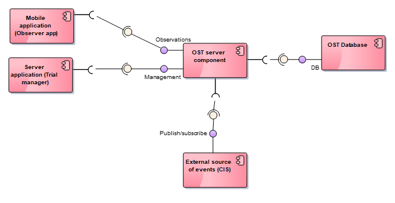
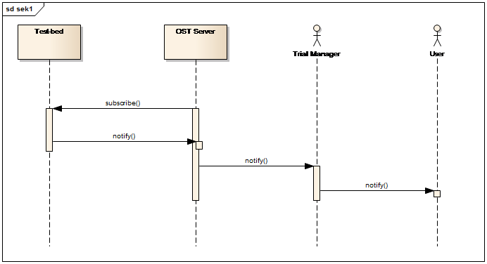
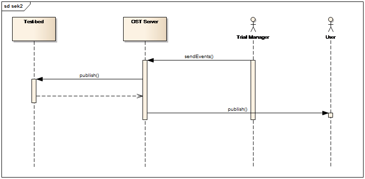
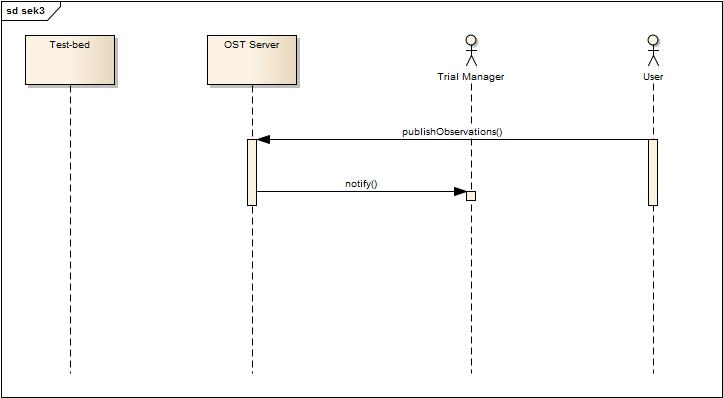
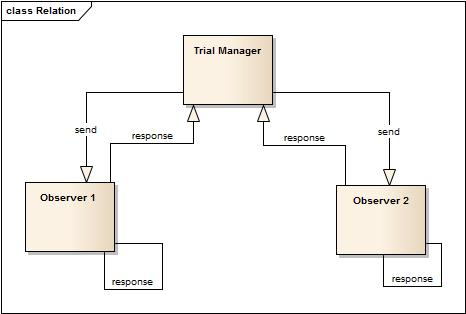
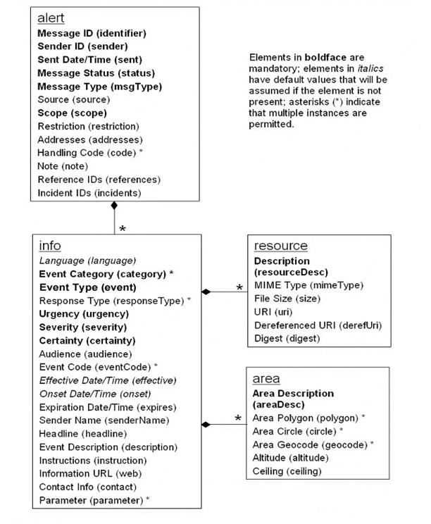

# Design

Including UML diagrams.

## OST and Test-bed Integration
There exists integration between Observer Support Tool Server and Test-Bed as an external system. Test-bed prepares data about events: names, description, trigger and time. Packages with that information are sent to OST Server. OST Server provides reacting on a trigger and displaying correctly events in time to user. 
In fact not only Test-bed is responsible for sending events. There is also possibility that Trial Manager sends such packages directly to users. 
Events with information about them and time are called Simulation Phases. 

### Events sent by Test-bed
Firstly OST Server has to subscribe Test-bed. Each time when new event is prepare, OST server receives a notification about it and forwards this message to Trial Manager and User. 

### Events sent by Trial Manager
If events are prepared by Trial Manager, he sends it to OST Server. From that repository event is published in Test-bed and also displayed to User. 

### Observations sent by User
Observation is sent directly to OST Server, which sends notification to the Trial Manager.

## Common Alerting Protocol 
Common Alerting Protocol Version 1.2 is the OASIS Standard we want to use modelling three processes in Observer Support Tool connected with relationship between Trial Manager and Observer and Test – bed.  

Diagram shows how 

According to OASIS Standard CAP consists of following elements: 

### Mapping CAP standard with OST functionalities:

