# Implementation details
Below are presented sample views for Observer and Trial Manager.

## Trial Manager View

#### Summary of Observation

#### Summary of Observation in Time
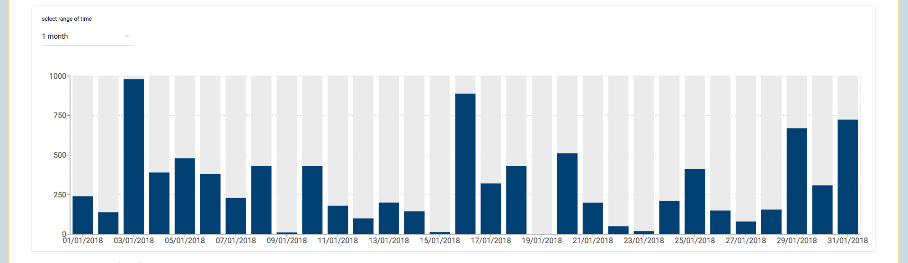
#### Events and Messages sent to Observer
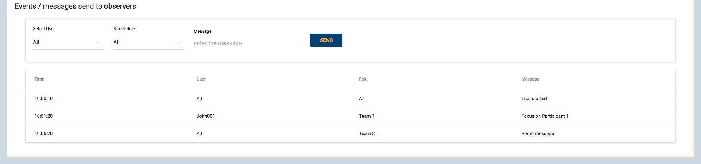

#### Welcome Window
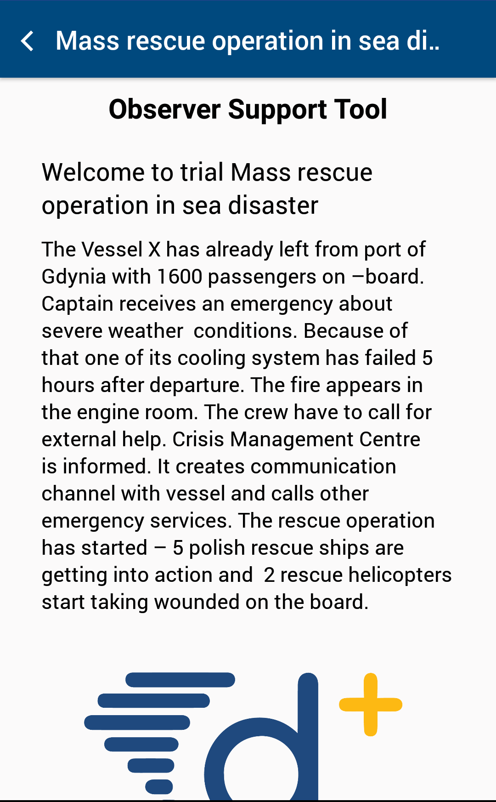

#### Trial
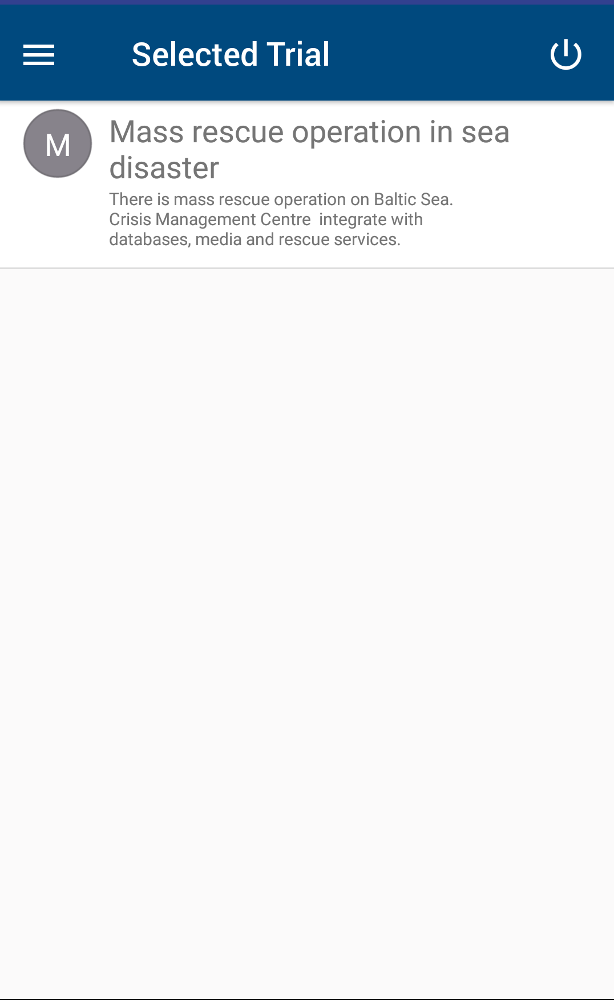

#### Events
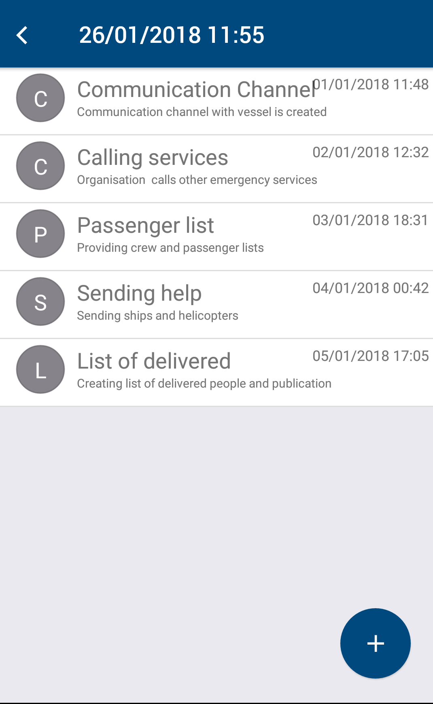

#### Observation Types
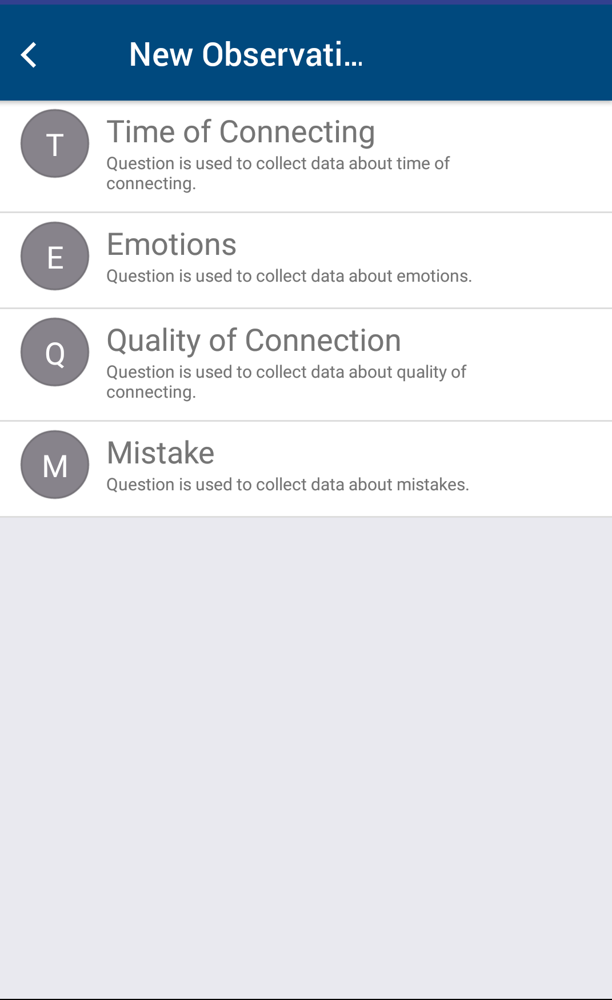

#### Sample questions
##### Radio buttons
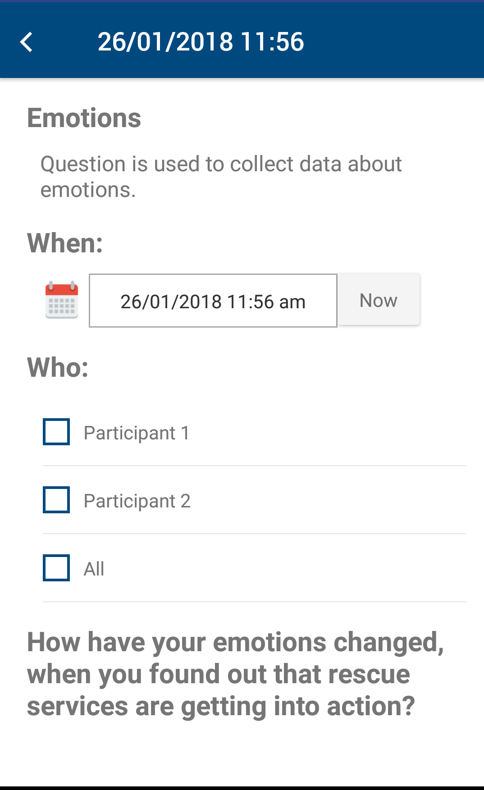
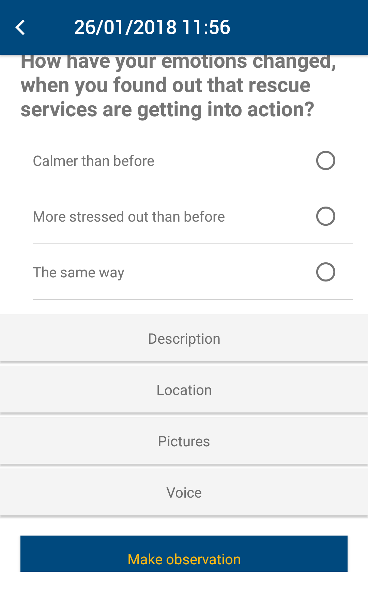
##### Checkboxes
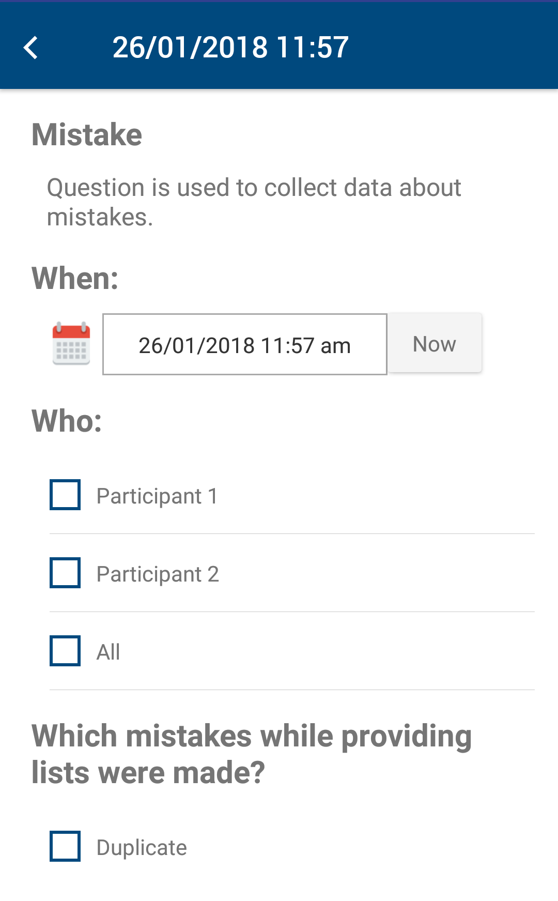
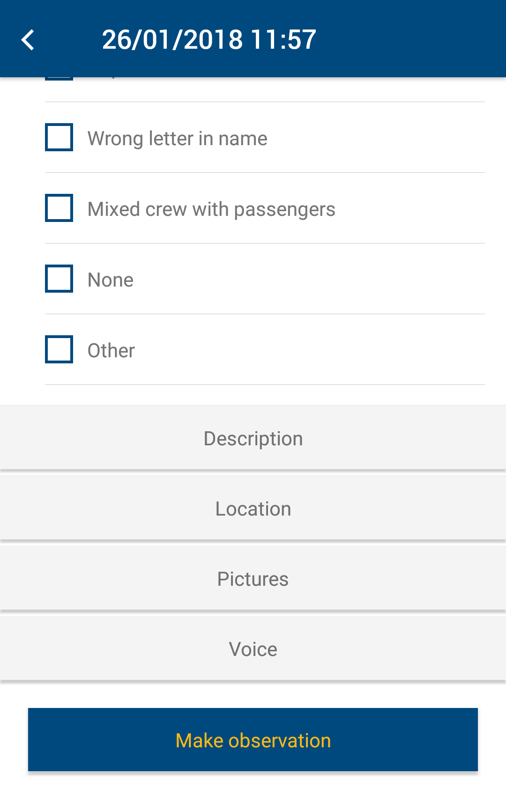
##### Slider
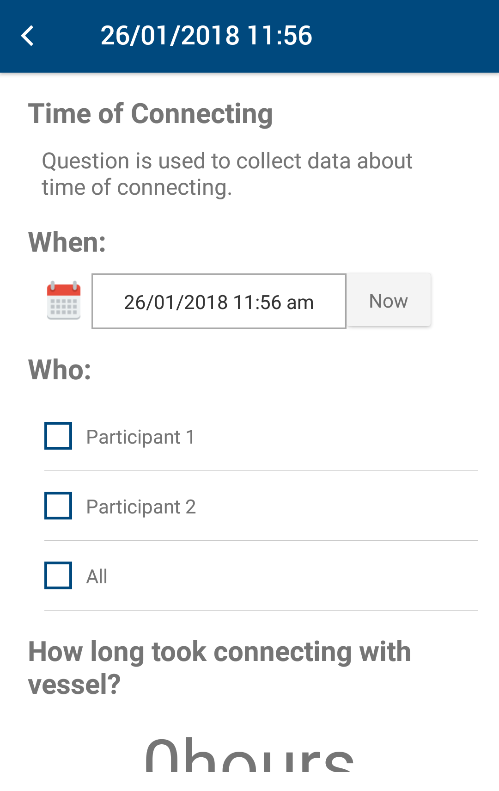
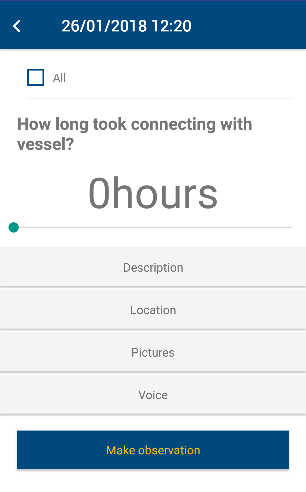

