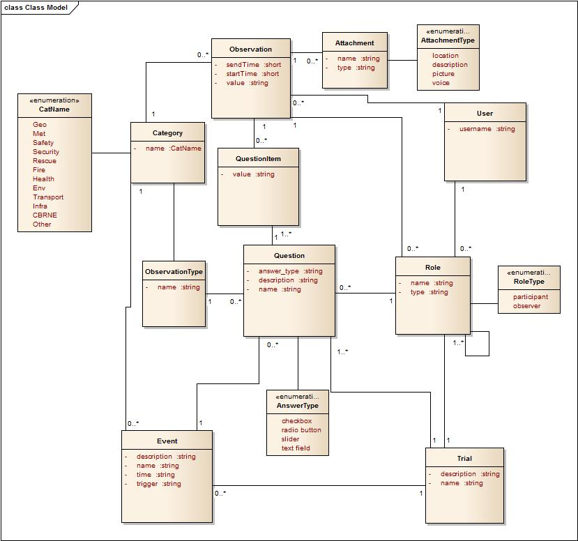

# Requirements

## Class Model

### User
User Class stores data about each user of an Observer Support Tool. User is always assigned to a particular Role, which can be an Observer or Participant. 
Except of the fact, that User is connected with Observation, there is also association between Observation and Role, which refers to a view with Observation, where Observer can choose which Participants he observes. 
If it comes to connection Question – Role, it means that both Observers and Participants can send their observations and answer questions. 
### Trial
Trial has a description and name. Each stage of trial is an event, which is being added in time. 
Assigning roles and creating questions occur on trial level. 
### Event
Event is a particular stage of scenario. It has following attributes: name, description, time and trigger.
Each event is assigned to a trial and many questions with question types are assigned to an event. User will have displayed a notification when a new event is added. That is why, event is a trigger. It is a key, because each new event has influence on generated questions. So, questions are very strongly dependent on time. 
Trigger in Event Class on a diagram is a key, unique ID which can affect changing questions. 
All data about events can be send to the tool database from external system – Test-bed.  
### Questions
Question is described by name, short description and Answer Type. Following Answer Types exist: checkboxes, radio buttons, text field and slider.
Each answer type determines a value of an answer. Observations that are filled by Observer dependent on answer type are stored in QuestionItem Class.
To observation user can also add some attachments which also have types: location, picture, voice and description.

### Category
Category class became created because of integration with Common Alerting Protocol.It says about the category of event or observation sent.
It can have followiong values: 
- “Geo” - Geophysical 
- “Met” - Meteorological 
- “Safety” - General emergency and public safety
- “Security” - Law enforcement, military, homeland and local/private security
- “Rescue” - Rescue and recovery
- “Fire” - Fire suppression and rescue
- “Health” - Medical and public health
- “Env” - Pollution and other environmental
- “Transport” - Public and private transportation
- “Infra” - Utility, telecommunication, other non-transport infrastructure
- “CBRNE” – Chemical, Biological, Radiological, Nuclear or High-Yield Explosive threat or attack
- “Other” - Other events

Category class is used differently dependent on the process. 
In process of sending Events from Trial Manager ot Test-bed to the User, Category is defined based on Event.  In process of sending Observations from the User to Trial Manager, category is defined based on Observation Type. 
