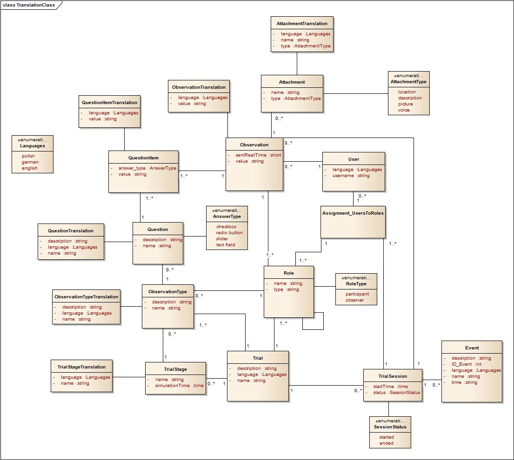

# Requirements

## Class Model

### User
User Class stores data about each user of an Observer Support Tool. User is always assigned to a particular Role, which can be an Observer or Participant. 
Except of the fact, that User is connected with Observation, there is also association between Observation and Role, which refers to a view with Observation, where Observer can choose which Participants he observes. 
If it comes to connection Question – Role, it means that both Observers and Participants can send their observations and answer questions. 
### Trial
Trial is defined by description, default language (english) and name. 
On the Trial Lebel there are defined following issues: 
- assignment of Roles to Users and assignment of 'Roles to Roles'. That means that Trial Manager gives regisered User a role (Participant or Observer) and then assignes Observers to Participants. 
- TrialStage – the stage of a Trial displayed to User. In one TrialStage ObservationTypes are defined - groups of questions, which are defined by description and name. 
- Roles assigned to ObservationTypes – Each ObservationType has defined some Participants, who are performed by checkboxes. That assignment pays attention on Każdy ObservationType ma zdefiniowanych jakichś uczestników (Participants), którzy są przedstawieni za pomocą checkboxów. That assignment shows that dependently from ObservationTypes there are displayed different Participants.
- Role przypisuje się też na poziomie Triala – Trial Manager decyduje wtedy ilu jest potrzebnych Observerów, ilu Participantów i którzy Userzy są przypisani do konkretnej roli. 
- Roles are also assigned on the Trial level - Trial Manager decides how many Observers and Participants are needed.

### Questions
Question is described by name, short description and Answer Type. Following Answer Types exist: checkboxes, radio buttons, text field and slider.
Each answer type determines a value of an answer. Observations that are filled by Observer dependent on answer type are stored in QuestionItem Class.
To observation user can also add some attachments which also have types: location, picture, voice and description.
Ważną cechą Triala jest jego sesyjność. Oznacza to, że jeden Trial może być prowadzony w kilku sesjach, które mogą być wygaśnięte, lub w toku. 
### Trial Session
In each session there can be new assignment of Roles to Users. On the session level there is a process of making Observations. 
From the Test - bed there are sent events defined as TrialStages and events which are triggers - they have an influence on changing the questions. 
### Translation
This model shows also new functionality of the tool. The application will be provided in different languages dependently on User's language. 

