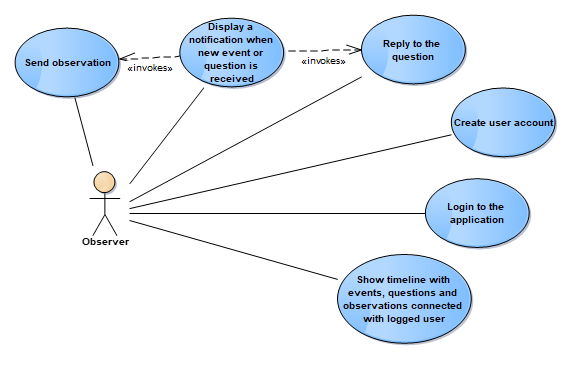
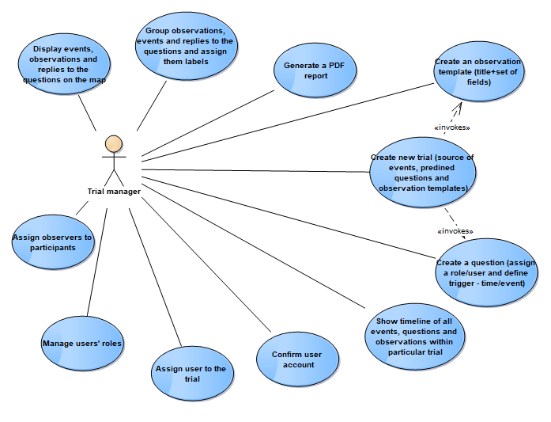

# Use cases and actors

Observer Support Tool’s aim is to  collect observations, inform observers about trial progress and visualize collected data. There are different perspective to look at this tool.  Main user, who uses the tool to send his observations is called Observer. From the other side there exists Trial Manager, he focuses on collected data and analysing it.  Each of them has their own functionalities provided by OST. 

## Use cases

### Use case: Observer

### Use Case: Trial Manager

## Actors

### User

Each user has his own account in the application. By given unique password and login user can logg into the OST. His main role in the OST is to fill in some questionnaires connected to the Trial he participates. 
User's interaface inculdes following views: 

- logging view
- view with list of Questionnaires
- one chosen Questionnaire that user can fill in
- list of Events and given Answers 
- view to change the Trial Session 

### Trial Manager

Trial Manager is a person who is responsible for managing not only the event but also the user. He has different view for OST than Observer. Trial Manager is responsible for creating new Trial Session, assigning registered users to a role in a Trial Session and sending some events to particular user. 

What Trial Manager has displayed are received answers which have been send. What is more, he can see the summary of observations in time on a diagram and change the range of time if it is needed.  To make analysing more comfortable, Trial Manager can export collected data to CSV file. 

If it comes to managing the Trial Session, Trial Manager has different options: 
- ha can set sesssion status - make it active or suspended
- he can change the trial stage.

#### Trial Manager interface:
1. Summary of Observations - collected data about observations are presented in the table. It indicates time of sent answer, name of User, ObservationType and the whole filled Questionnaire. 
Below there is a chart whcih shows how many answers Trial Manageer got in selected range of time. 

3. Events/Messages sent to Observers - in this view, Trial Manager can send events/messages to the users. He can either select the user or select the role. Here Trial Manager has to enter the Title and content of the message. 
Below there is presented the table with listed sent Events. 

4. New Session - in this view Trial Manager can create new Trial Session. He decides which Trial is connected with new session. Then Trial Manager can choose inital stage of the session and its status. Trial Manager can also decide about Login Prefix of a user.
In this panel users accounts are created. By entering users emails, password and login for each of them are generated. Here, Trial Manager also assignes users to the roles. 
If it comes to the passwords and login - Trial Mananger can decide if he wants to obtain list with all passwords and logins or to send each password and login to particular user (on his mail address). 

